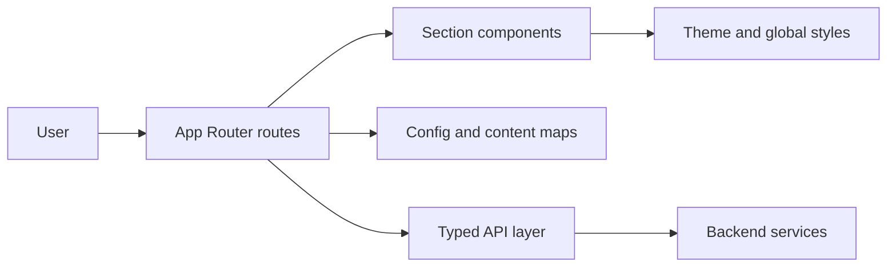
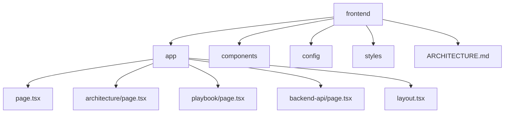
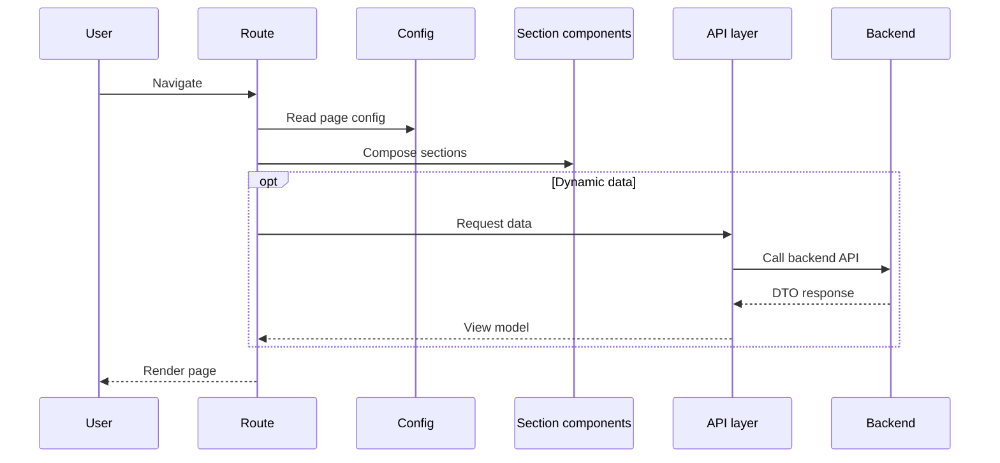
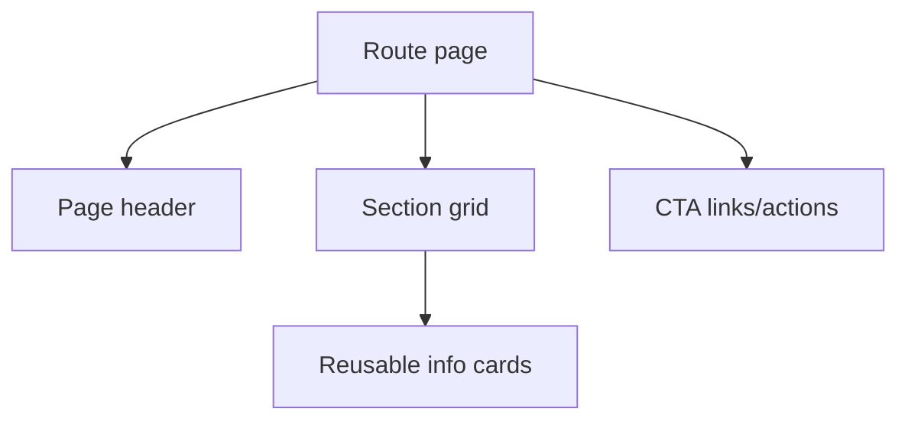
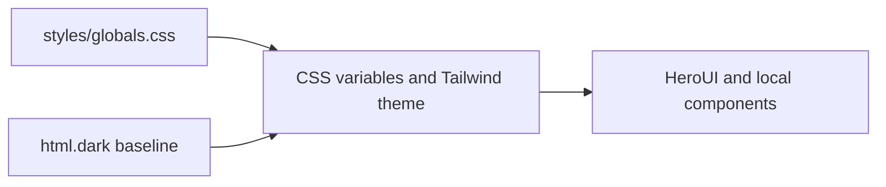
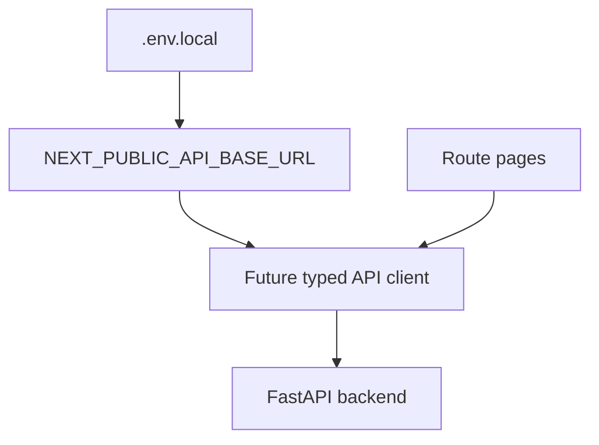
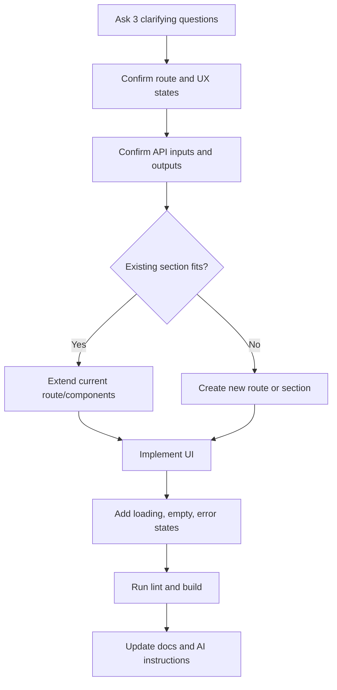
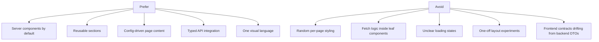
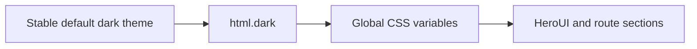

# Frontend Architecture

This frontend is a HeroUI and Next.js template optimized for aesthetic defaults, explicit extension points, and AI-assisted feature delivery.

## System Map

## Current Layout

## Rendering Flow

## Page Composition

## Styling Model

## Integration Boundary

## Feature Workflow

## Guardrails

## Theme Baseline

